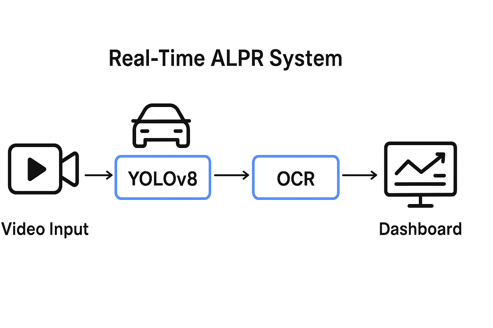

🚗 Real-time ALPR system – detects vehicles, reads license plates, and visualizes results live.

# Real-Time ALPR System

## System Architecture

ALPR system follows a modern computer vision pipeline:

1. **Video Input**: Capture from camera or video file
2. **YOLOv8 Detection**: Detect vehicles and license plates
3. **OCR Processing**: Extract text using EasyOCR
4. **Dashboard Output**: Display results in real-time dashboard

## Features
- Real-time video processing
- YOLOv8-based vehicle and plate detection
- OCR text extraction with high accuracy
- Interactive web dashboard
- Comprehensive logging system
